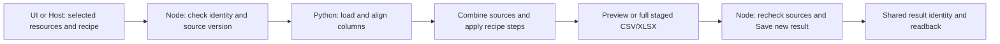

# Keeproot architecture and evidence

## Responsibilities

- Node.js 24 ESM: Runtime/CLI, built-in SQLite, project/resource identities, revision checks, file boundaries, Save and recovery.
- Python: local tables, documents, PDF and Desktop components.
- PowerShell: installation, upgrade and uninstall entry.
- HTML/WebView2: local user work surface.
- External host: semantic reasoning and content generation. Explicit JSON calls use the same objects as the UI.

Shared services execute supported operations; UI routes assemble them. Save results bind source identities and versions. Restore operations recheck conflicts and refuse later edits or incomplete dependencies.

## Python processing pipeline

This is an implemented, ordered table recipe, not an arbitrary Python job runner or DAG scheduler. Node owns work identity, revision, file boundaries and recovery. Python/pandas performs the calculations on the selected CSV/XLSX sources. Both the Table UI and the Host-facing Table Module use this chain:

| Implemented step | Current boundary |
|---|---|
| Combine and clean | Concatenate sources; inner/left join exactly two sources; rename/select/cast/filter/fill-null/deduplicate/sort |
| Grouped sum | One dimension and one numeric measure; explicit unit and empty-value policy; up to 500 groups |
| Pivot | Two categorical axes and one summed measure; row/column/grand totals, shares and ranks; up to 40 row groups and 12 column groups |
| Monthly trend | Date-only input, monthly sums and adjacent period comparison; difference and growth percentage |

Each recipe supports one aggregation step. General count/mean/median aggregation, multi-measure reports, forecasting, arbitrary Python scripts, scheduled jobs and a general pipeline graph are not implemented. Semantic conclusions belong to the external Host.

The callable processing entry is [`atlas_content data-work`](<../python/src/atlas_content/__main__.py>). Its [`data_work.py`](<../python/src/atlas_content/data_work.py>) implements `_multi_work`, `_group_aggregate`, `_pivot_aggregate` and `_trend_aggregate`. The Node subprocess boundary is [`runDataWork`](<../src/content-inspection.js>); the current consumers are [`data-work-service`](<../src/ui/services/data-work-service.js>), [`Table Work Module`](<../src/table-work-module.js>) and [`Table UI`](<../src/ui/views/data-work-view.js>).

Direct regressions execute the real Python process, read its numeric output through the Module, render the same facts in HTML and save the full result. They also check unchanged inputs and refusal after a source changes. Expected fixture results are independent of Host prose:

- [Grouped sum](<../test/data-work-aggregate.test.js>): all 60 nonempty rows contribute, including rows beyond the preview.
- [Pivot](<../test/data-work-pivot.test.js>): North 400, South 70, total 470; shares and ranks derive from that total.
- [Trend](<../test/data-work-trend.test.js>): previous period 500, current period 550, difference 50 and growth 10%.

These are representative fixture checks, not real-project or human semantic acceptance. Bundled PDF.js and markdown-it are identified as third-party code in `.gitattributes`; GitHub language proportions do not measure implemented capabilities.

## Evidence limits

Repository regressions and representative isolated CLI/HTML workflows have exercised supported operations. These do not establish security certification, enterprise scale, cross-platform compatibility, subjective usability or broad real-project success. The prepared demo is fictional and uses a preconfigured recipe; it does not prove AI inference about a real library.

The public Git history preserves development dates and branch ancestry after privacy filtering. Internal work logs and raw execution receipts are not distributed. Current native scaling and second-product host acceptance remain pending.

## Third-party components

Bundled Markdown and PDF implementations keep their upstream notices. Python environments keep package metadata and licenses. See the [component index](<./Atlas V1 使用说明书.md#components>). Original project code and artwork currently have no selected project-wide open-source license.
